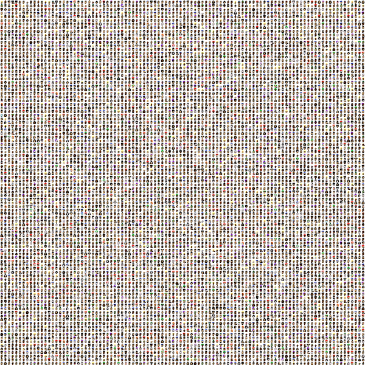

# Mint Your Own Punks in Original 24x24 Pixel Format or With 2X / 4X / 8X Zoom


## Step 0 -  Download the True Official Genuine CryptoPunks™ composite image

One time / first time only - Download the True Official Genuine CryptoPunks™ composite
housing all 10 000 CryptoPunks
in a single 2400×2400 image (~830 kb) for free.
See [`punks.png` »](https://github.com/larvalabs/cryptopunks/blob/master/punks.png)





Let's create a script to mint punks.

## Step 1 -  Read True Official Genuine CryptoPunks™ composite image


``` ruby
require 'cryptopunks'

punks = Punks::Image.read( './punks.png' )
```


## Step 2 - Start minting

Note: By default punks get saved in the original 24x24 pixel format
and the first punk starts at index zero, that is, `0`.
running up to 9999.

``` ruby
punks[0].save( './punk-0000.png' )
punks[2890].save( './punk-2890.png' )
punks[8219].save( './punk-8219.png')
```


And voila!


Let's change the zoom factor:

``` ruby
punks.zoom = 4   # use x4

punks[0].save( './punk-0000x4.png' )
punks[2890].save( './punk-2890x4.png' )
punks[8219].save( './punk-8219x4.png')

punks.zoom = 8   # or use x8

punks[0].save( './punk-0000x4.png' )
punks[2890].save( './punk-2890x4.png' )
punks[8219].save( './punk-8219x4.png')

```

And x4:


And x8:


And so on. Happy miniting.


