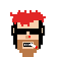

# Inside the Punk Art Machinery - How To Generate 10 000 Punks (and Punkettes), Algorithmically - Paint by Numbers


The bad news - the formula for the original 10 000 algorithmically generated CryptoPunks by LavraLabs is a secret
(and not included in the published open source code).

The good news - the CryptoPunks remake on the Polkadot blockchain
built with Substra(te) ("SubtraPunks") by Usetech
includes the art and code to generate
algorithmically punks (and punkettes) with a fresh look.


Let's convert the original [`punk_generator.js`](https://github.com/usetech-llc/substrapunks/blob/master/scripts/punk_generator.js) art machinery.
Let's start with all the parts of a punk:


``` ruby
PARTS = {
  face:  { required: true,
           attributes: [['', 'u'],
                        ['', 'u']] },
  mouth: { required: true,
           attributes: [['Black Lipstick',  'f'],
                        ['Red Lipstick',    'f'],
                        ['Smile',           'u'],
                        ['',                'u'],
                        ['Teeth Smile',     'm'],
                        ['Purple Lipstick', 'f']] },
  nose:  { required: true,
           attributes: [['',          'u'],
                        ['Nose Ring', 'u']] },
  eyes:  { required: true,
           attributes: [['',              'u'],
                        ['Asian Eyes',    'u'],
                        ['Sun Glasses',   'u'],
                        ['Red Glasses',   'u'],
                        ['Round Eyes',    'u']] },
  ears:  { required: true,
           attributes: [['',              'u'],
                        ['Left Earring',  'u'],
                        ['Right Earring', 'u'],
                        ['Two Earrings',  'u']] },
  beard: { required: false,
           attributes: [['Brown Beard',     'm'],
                        ['',                'u'],
                        ['Mustache-Beard',  'm'],
                        ['',                'u'],
                        ['Mustache',        'm'],
                        ['',                'u'],
                        ['Regular Beard',   'm'],
                        ['',                'u']] },
  hair:  { required: false,
           attributes: [['Up Hair',        'm'],
                        ['Down Hair',      'u'],
                        ['Mahawk',         'u'],
                        ['Red Mahawk',     'u'],
                        ['Orange Hair',    'u'],
                        ['Bubble Hair',    'm'],
                        ['Emo Hair',       'u'],
                        ['Thin Hair',      'm'],
                        ['Bald',           'm'],
                        ['Blonde Hair',    'f'],
                        ['Caret Hair',     'f'],
                        ['Pony Tails'      'f']] },
  access: { required: false,
            attributes: [['Cigar',        'u'],
                         ['Pipe',         'u']] }
}
```

A punk is composed of eight parts, that is,

- Face
- Mouth
- Nose
- Eyes
- Ears
- Beard
- Hair
- Accessoire

The first five parts are always required
and the last three optional.


For every part there is a matching directory (e.g. `/face`, `/mouth`, `/nose`, etc.) and
for every attribute there is a matching image with an index number starting at 1 (e.g. `/face/face1.png`, `face/face2.png`, etc.)
Find a cached copy of all images in the `i/parts` directory -
looking something like:

```
/parts
├─── access/
│       access1.png
│       access2.png
│
├─── beard/
│       beard1.png
│       beard2.png
│       beard3.png
│       beard4.png
│       beard5.png
│       beard6.png
│       beard7.png
│       beard8.png
│
├───ears/
│       ears1.png
│       ears2.png
│       ears3.png
│       ears4.png
│
├───eyes/
│       eyes1.png
│       eyes2.png
│       eyes3.png
│       eyes4.png
│       eyes5.png
│
├───face/
│       face1.png
│       face2.png
│
├───hair/
│       hair1.png
│       hair2.png
│       hair3.png
│       hair4.png
│       hair5.png
│       hair6.png
│       hair7.png
│       hair8.png
│       hair9.png
│       hair10.png
│       hair11.png
│       hair12.png
│
├───mouth/
│       mouth1.png
│       mouth2.png
│       mouth3.png
│       mouth4.png
│       mouth5.png
│       mouth6.png
│
└───nose/
        nose1.png
        nose2.png
```


Let's generate
the famous Blond Punkette
with:

- Red Lipstick (f)
- Nose Ring (u)
- Sun Glasses (u)
- Blonde Hair (f)
- Cigar (u)

Note: The u/f/m stands for unisex/female/male
and tells you what gender the attribute expects.


Let's code the artist known as  `generate_punk` - a method
that returns a (ready-to-save) punk image
from the attribute parts coded as numbers
starting at 1. If the code is 0 than
the (optional) part gets skipped.


``` ruby
codes = [2, 2, 2, 3, 1, 0, 10, 1]
punk = generate_punk( codes )
punk.save( './punk-0000.png' )
```


And here's the magic paint by number art machinery:

``` ruby
require 'chunky_png'    ## helper library for png images


def generate_punk( codes )
  punk = ChunkyPNG::Image.new( 560, 560, ChunkyPNG::Color::WHITE )

  PARTS.each_with_index do |(key,part),i|
    code  = codes[i]
    if code != 0    ## if code 0 - skip optional part

      ## for debugging print attributes with names (size not 0, that is, "")
      attribute = part[:attributes][ code-1 ]
      puts "#{key}#{code} - #{attribute[0]} (#{attribute[1]})"  if attribute[0].size > 0

      ## compose parts on top (from face to accessoire)
      path = "./i/parts/#{key}/#{key}#{code}.png"
      part = ChunkyPNG::Image.from_file( path )
      punk.compose!( part, 0, 0 )
    end
  end

  punk
end
```

Let's try for real:

``` ruby
codes = [2, 2, 2, 3, 1, 0, 10, 1]
punk = generate_punk( codes )
punk.save( './punk-0000.png' )
```

printing:

```
mouth2 - Red Lipstick (f)
nose2 - Nose Ring (u)
eyes3 - Sun Glasses (u)
hair10 - Blonde Hair (f)
access1 - Cigar (u)
```


and resulting in:


Note: By default the image size is 560x560 pixel.

How does the machinery work?
The algo generates an empty 560x560 pixel image / canvas
and than adds - or is that composes -
one part after the other on top
all the way from face to accessoire.
That's all the magic.


Let's generate another punk.

``` ruby
codes = [1, 5, 2, 3, 1, 1, 5, 1]
generate_punk( codes ).save( './punk-0001.png' )
```

printing:

```
mouth5 - Teeth Smile (m)
nose2 - Nose Ring (u)
eyes3 - Sun Glasses (u)
beard1 - Brown Beard (m)
hair5 - Orange Hair (u)
access1 - Cigar (u)
```

and resulting in:




Now let's generate 10 000, algorithmically! Yes, you can!

