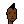
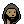
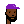
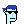
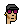
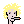
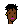
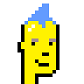
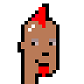

# 10 000 More Punks - Inside the Punk Art Machinery (Continued) - How To Generate Punks, Algorithmically - Paint by Numbers - A New Punk Series

> 9 rare CryptoPunks from the LavraLabs [24×24 pixel] series to 
> star in our 21st Century Evening Sale this May in New York.
>
> All mint numbers under 1k and yes there is a rare Alien! 
> Punks 2, 
> 532, 
> 58, 
> 30, 
> 635, 
> 602, 
> 768, 
> 603, 
> 757. 
>
> -- [Christie's [- The World's Leading Auction House], April 2021](https://twitter.com/ChristiesInc/status/1380236081472364550)


The bad news - the formula for the original 10 000 algorithmically generated 24×24 pixel CryptoPunks by LavraLabs is a secret
(and not included in the published open source code).


The good news  -  emirongrr has put together a simple
pixel art generator to get your started with your
own punk series.


Let's convert the [`pixel art generator`](https://github.com/emirongrr/pixelArt_Generator) machinery.
Let's start with all the parts of a punk:


``` ruby
PARTS = {
  face:     { },
  hair:     { offset: [94, 5] },
  glasses:  { offset: [73, 86] },
  beard:    { offset: [147, 258] },
}
```

A punk is composed of four parts, that is,

- Face
- Hair
- Glasses
- Beard

The face - the first part - is always required
and the rest is optional.

For every part there is a matching directory (e.g. `/face`, `/hair`, `/glasses`, etc.) and
for every attribute there is a matching image with an index number starting at 1 (e.g. `/face/face1.png`, `face/face2.png`, etc.)
Find a cached copy of all images in the `i/parts_ii` directory -
looking something like:

```
parts_ii/
  ├───face/
  │       face1.png
  │       face2.png
  │       face3.png
  │       face4.png
  ├───hair/
  │       hair1.png
  │       hair2.png
  │       hair3.png
  ├───glasses/
  │       glasses1.png
  │       glasses2.png
  └───beard/
          beard1.png
          beard2.png
```

Note: Yes, you can add new variants.
Only make sure that the image size for the parts
matches the following formats - only the face is in the 100% full-size 336x336 format:

- face => 336x336
- hair => 145x131
- glasses => 190x109
- beard => 58x54

The offset  (see in `PARTS` above e.g. `offset: [94, 5]`)
tells the starting x,y-coordinates where the part
will get pasted into the full-size 336x336 punk image
e.g. for hair it's x=94, y=5,
for glasses it's x=73, y=86 and so on.


Let's code the artist known as  `generate_punk` - a method
that returns a (ready-to-save) punk image
from the attribute parts coded as numbers
starting at 1. If the code is 0 than
the (optional) part gets skipped.


``` ruby
codes = [1,1,0,0]        # face (1), hair (1), glasses (x), beard (x)
punk = generate_punk( codes )
punk.save( "./i/punk-1100.png" )
```


And here's the magic paint by number art machinery:

``` ruby
require 'chunky_png'    ## helper library for png images

def generate_punk( codes )
  punk = ChunkyPNG::Image.new( 336, 336, ChunkyPNG::Color::WHITE )

  PARTS.each_with_index do |(key,part),i|
    code  = codes[i]
    if code != 0    ## if code 0 - let's you skip optional part

      ## compose parts on top (from face to beard)
      path = "./i/parts_ii/#{key}/#{key}#{code}.png"
      img  = ChunkyPNG::Image.from_file( path )
      x, y = part[:offset] || [0, 0]
      punk.compose!( img, x, y )
    end
  end

  punk
end
```


Let's try for real:

``` ruby
codes = [1,1,0,0]        # face (1), hair (1), glasses (x), beard (x)
punk = generate_punk( codes )
punk.save( "./punk-1100.png" )
```

resulting in:




How does the machinery work?
The algo generates an empty 336x336 pixel image / canvas
and than adds - or is that composes -
one part after the other on top
all the way from face to beard.
That's all the magic.


Let's generate another punk.

``` ruby
codes = [2,3,0,1]    # face (2), hair (3), glasses (x), beard (1)
punk = generate_punk( codes )
punk.save( "./punk-#{codes.join}.png" )
```

resulting in:




And let's generate another punk.

``` ruby
codes = [3,0,2,2]       # face (3), hair (x), glasses (2), beard (2)
punk = generate_punk( codes )
punk.save( "./punk-#{codes.join}.png" )
```

resulting in:


Now generate your own punk series, algorithmically! Yes, you can!

