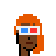
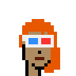
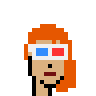

# United Colors of Humanity - Light, Lighter, Dark, Darker - How To Change Skin Tones


The punks
in the original Lavra labs 24×24 series are
available in four base colors / skin tones.


Let's have a looksie at the super-rare punks with zero accessories / attributes -
[#3307](https://www.larvalabs.com/cryptopunks/details/3307),
[#281](https://www.larvalabs.com/cryptopunks/details/281),
[#510](https://www.larvalabs.com/cryptopunks/details/510),
[#741](https://www.larvalabs.com/cryptopunks/details/741):


``` ruby
require 'cryptopunks'

punks = Punks::Image::Composite.read( './punks.png' )

ids = [3307, 281, 510, 741]
ids.each do |id|
  name = '%04d' % id
  punk = punks[id]
  punk.save( "./punk-#{name}.png" )
  punk.zoom(4).save( "./punk-#{name}x4.png" )
end
```

Voila!


And let's look at the punkettes -
[#6487](https://www.larvalabs.com/cryptopunks/details/6487),
[#641](https://www.larvalabs.com/cryptopunks/details/641),
[#1050](https://www.larvalabs.com/cryptopunks/details/1050),
[#2204](https://www.larvalabs.com/cryptopunks/details/2204):

``` ruby
ids = [6487, 641, 1050, 2204]
ids.each do |id|
  name = '%04d' % id
  punk = punks[id]
  punk.save( "./punk-#{name}.png" )
  punk.zoom(4).save( "./punk-#{name}x4.png" )
end
```

Voila!


Let's look at all the colors in use for punkette #2204.
`punk.pixels.uniq` gets you all unique pixels, that is, all colors:

``` ruby
punk = punks[1050]
colors = punk.pixels.uniq
#=> [0, 255, 1899961855, 2337484031, 1445331199, 1916209663, 1242694143]

colors.count
#=> 7
```

Let's calculate the color usage by pixel count (using the 24×24 original size, that is, out of a total of 576 pixels):

``` ruby
usage = Hash.new(0)
punk.pixels.each do |color|
  usage[ color ] += 1
end
#=> {0          => 428,
#    255        => 45,
#    1899961855 => 93,
#    2337484031 => 1,
#    1445331199 => 4,
#    1916209663 => 2,
#    1242694143 => 3}
```

And let's pretty print the colors:

``` ruby
usage.each do |color,count|
  print "%3d  " % count
  print Color.format( color )
  print "\n"
end
```

Resulting in:

```
428  #000000 / rgb(  0   0   0) - hsl(  0°   0%   0%) - α(  0%) - TRANSPARENT
 45  #000000 / rgb(  0   0   0) - hsl(  0°   0%   0%)           - BLACK
 93  #713f1d / rgb(113  63  29) - hsl( 24°  59%  28%)
  1  #8b532c / rgb(139  83  44) - hsl( 25°  52%  36%)
  4  #562600 / rgb( 86  38   0) - hsl( 27° 100%  17%)
  2  #723709 / rgb(114  55   9) - hsl( 26°  85%  24%)
  3  #4a1201 / rgb( 74  18   1) - hsl( 14°  97%  15%)
```

Let's try the punk #741 - resulting in:

```
385  #000000 / rgb(  0   0   0) - hsl(  0°   0%   0%) - α(  0%) - TRANSPARENT
 55  #000000 / rgb(  0   0   0) - hsl(  0°   0%   0%)           - BLACK
128  #713f1d / rgb(113  63  29) - hsl( 24°  59%  28%)
  2  #8b532c / rgb(139  83  44) - hsl( 25°  52%  36%)
  4  #562600 / rgb( 86  38   0) - hsl( 27° 100%  17%)
  2  #723709 / rgb(114  55   9) - hsl( 26°  85%  24%)
```

Let's analyze the color scheme.
Every punkette has five base colors (plus transparent and black)
and every punk has four base colors.

What's missing? If you zoom in on the mouth, that is, the three-pixel line -
you will see it's always black for males but punkettes use a dedicated
base color.


Let's try the lighter punkette #1050 - resulting in:

```
428  #000000 / rgb(  0   0   0) - hsl(  0°   0%   0%) - α(  0%) - TRANSPARENT
 45  #000000 / rgb(  0   0   0) - hsl(  0°   0%   0%)           - BLACK
 93  #ae8b61 / rgb(174 139  97) - hsl( 33°  32%  53%)
  1  #b69f82 / rgb(182 159 130) - hsl( 33°  26%  61%)
  4  #86581e / rgb(134  88  30) - hsl( 33°  63%  32%)
  2  #a77c47 / rgb(167 124  71) - hsl( 33°  40%  47%)
  3  #5f1d09 / rgb( 95  29   9) - hsl( 14°  83%  20%)
```

And punkette #641:

```
428  #000000 / rgb(  0   0   0) - hsl(  0°   0%   0%) - α(  0%) - TRANSPARENT
 45  #000000 / rgb(  0   0   0) - hsl(  0°   0%   0%)           - BLACK
 93  #dbb180 / rgb(219 177 128) - hsl( 32°  56%  68%)
  1  #e7cba9 / rgb(231 203 169) - hsl( 33°  56%  78%)
  4  #a66e2c / rgb(166 110  44) - hsl( 32°  58%  41%)
  2  #d29d60 / rgb(210 157  96) - hsl( 32°  56%  60%)
  3  #711010 / rgb(113  16  16) - hsl(  0°  75%  25%)
```

And punkette #6487:

```
428  #000000 / rgb(  0   0   0) - hsl(  0°   0%   0%) - α(  0%) - TRANSPARENT
 45  #000000 / rgb(  0   0   0) - hsl(  0°   0%   0%)           - BLACK
 93  #ead9d9 / rgb(234 217 217) - hsl(  0°  29%  88%)
  1  #ffffff / rgb(255 255 255) - hsl(  0°   0% 100%)           - WHITE
  4  #a58d8d / rgb(165 141 141) - hsl(  0°  12%  60%)
  2  #c9b2b2 / rgb(201 178 178) - hsl(  0°  18%  74%)
  3  #711010 / rgb(113  16  16) - hsl(  0°  75%  25%)
```

And let's double check the color scheme trying the remaining punks:

```
385  #000000 / rgb(  0   0   0) - hsl(  0°   0%   0%) - α(  0%) - TRANSPARENT
 55  #000000 / rgb(  0   0   0) - hsl(  0°   0%   0%)           - BLACK
128  #ae8b61 / rgb(174 139  97) - hsl( 33°  32%  53%)
  2  #b69f82 / rgb(182 159 130) - hsl( 33°  26%  61%)
  4  #86581e / rgb(134  88  30) - hsl( 33°  63%  32%)
  2  #a77c47 / rgb(167 124  71) - hsl( 33°  40%  47%)

385  #000000 / rgb(  0   0   0) - hsl(  0°   0%   0%) - α(  0%) - TRANSPARENT
 55  #000000 / rgb(  0   0   0) - hsl(  0°   0%   0%)           - BLACK
128  #dbb180 / rgb(219 177 128) - hsl( 32°  56%  68%)
  2  #e7cba9 / rgb(231 203 169) - hsl( 33°  56%  78%)
  4  #a66e2c / rgb(166 110  44) - hsl( 32°  58%  41%)
  2  #d29d60 / rgb(210 157  96) - hsl( 32°  56%  60%)

385  #000000 / rgb(  0   0   0) - hsl(  0°   0%   0%) - α(  0%) - TRANSPARENT
 55  #000000 / rgb(  0   0   0) - hsl(  0°   0%   0%)           - BLACK
128  #ead9d9 / rgb(234 217 217) - hsl(  0°  29%  88%)
  2  #ffffff / rgb(255 255 255) - hsl(  0°   0% 100%)           - WHITE
  4  #a58d8d / rgb(165 141 141) - hsl(  0°  12%  60%)
  2  #c9b2b2 / rgb(201 178 178) - hsl(  0°  18%  74%)
```


What's the point?
Now you can pick any punk and change the skin tones as you like.
Let's try punkette #6043 with orange side and 3d glasses.


``` ruby
punk = punks[6043]
punk.save( "./punk-6043.png" )
punk.zoom(4).save( "./punk-6043x4.png" )
```





``` ruby
darker_to_dark = {
 '#713f1d' => '#ae8b61',
 '#8b532c' => '#b69f82',
 '#562600' => '#86581e',
 '#723709' => '#a77c47',
 '#4a1201' => '#5f1d09',
}

punk_dark = punk.change_colors( darker_to_dark )
punk_dark.save( "./punk-6043_dark.png" )
punk_dark.zoom(4).save( "./punk-6043_darkx4.png" )


darker_to_light = {
 '#713f1d' => '#dbb180',
 '#8b532c' => '#e7cba9',
 '#562600' => '#a66e2c',
 '#723709' => '#d29d60',
 '#4a1201' => '#711010',
}

punk_light = punk.change_colors( darker_to_light )
punk_light.save( "./punk-6043_light.png" )
punk_light.zoom(4).save( "./punk-6043_lightx4.png" )


darker_to_lighter = {
 '#713f1d' => '#ead9d9',
 '#8b532c' => '#ffffff',
 '#562600' => '#a58d8d',
 '#723709' => '#c9b2b2',
 '#4a1201' => '#711010',
}

punk_lighter = punk.change_colors( darker_to_lighter )
punk_lighter.save( "./i/punk-6043_lighter.png" )
punk_lighter.zoom(4).save( "./i/punk-6043_lighterx4.png" )
```


Resulting in:






Now use your own colors. Yes, you can!
