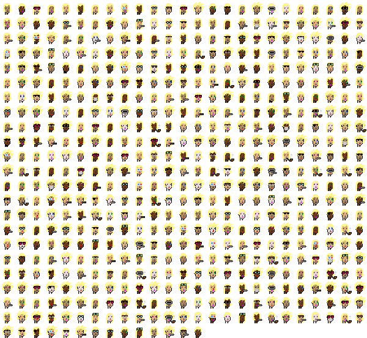
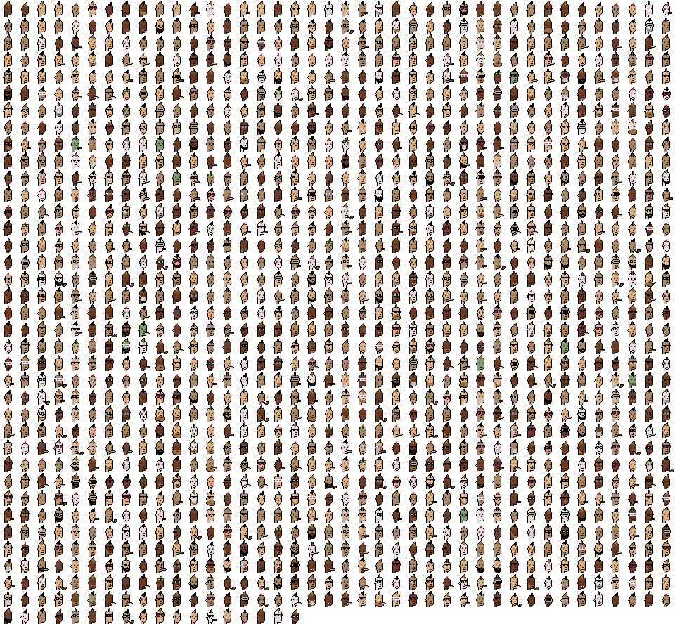

# Revolutionize the Digital Art Market - Fractionalize The World's First Billion Dollar Pixel Image - Build Your Own All-In-One Punk Composites - Curate Your Own Exclusive Collections Ready to Sell Off to New Owners


## The World's First Billion Dollar Pixel Image

Inspired by the composite image (2400×2400) that holds all 10 000 cryptopunks
in the original 24×24 design -  currently (as of March 2021) estimated
at around $2 000 million (yes, that is, $2 billion)
according to the [Institute For the Future (IFF) at the University of Nicosia](https://nftvaluations.com/cryptopunks) "scientific" valuation formula:


Let's put together new all-in-one composites that break up
(or is that fractionalize?)
the 10 000 cryptopunks money printing machine into smaller
curated collections ready to sell off to new owners
(or is that fools?).


## Step 1 -  Read True Official Genuine CryptoPunks™ composite image


``` ruby
require 'cryptopunks'

punks = Punks::Image::Composite.read( './punks.png' )
```


## Alien Millionaire's Row - Diamond Elite Circle

Let's start with the smallest and most elite batch
featuring an exclusive set of all nine aliens.


Read in the datasets holding all the metadata for all 10 000 punks:

``` ruby
recs = Punks::Dataset.read( './punks/*.csv' )
recs.size
#=> 10000
```

And find all alien records:

``` ruby
aliens = recs.select {|rec| rec.alien? }
aliens.size
#=> 9
```

Let's put the nine aliens in a quadratic 3x3 composite:

``` ruby
composite = Punks::Image::Composite.new( 3, 3 )
aliens.each do |rec|
   composite << punks[ rec.id ]
end

composite.save( 'aliens.png' )
```

Voila!


## Planet of the Apes - Platium Elite Circle

Let's try a bigger batch
featuring an exclusive set of all twenty-four apes.

Find all ape records:

``` ruby
apes = recs.select {|rec| rec.apes? }
apes.size
#=> 24
```

Let's put the twenty-four apes in a 4x6 composite:

``` ruby
composite = Punks::Image::Composite.new( 4, 6 )
apes.each do |rec|
   composite << punks[ rec.id ]
end

composite.save( 'apes.png' )
```

Voila!


## CryptoZombies, the Punk Edition

Let's try an exclusive set featuring all zombies
or is that CryptoZombies?

Find all zombie records:

``` ruby
zombies = recs.select {|rec| rec.zombie? }
zombies.size
#=> 88
```

Let's put the eighty-eight zombies in a 8x11 composite:

``` ruby
composite = Punks::Image::Composite.new( 8, 11 )
zombies.each do |rec|
   composite << punks[ rec.id ]
end

composite.save( 'zombies.png' )
```

Voila!


## Blondies Have More Fun - Gold Elite Circle

Let's try an exclusive set featuring all blondies -
that is, all females with the hair style attribute of
Blonde Short, Blonde Bob, Wild Blonde, or Straight Hair Blonde.

Find all blondie records:

``` ruby
blondies = recs.select do |rec|
                            rec.female? &&
                            (rec.has?( 'Blonde Short' ) ||
                             rec.has?( 'Blonde Bob' ) ||
                             rec.has?( 'Wild Blonde') ||
                             rec.has?( 'Straight Hair Blonde'))
                      end
blondies.size
#=> 564
```

Let's put the 564 blondies in a 25x23 (max. 575) composite:


``` ruby
composite = Punks::Image::Composite.new( 25, 23 )
blondies.each do |rec|
   composite << punks[ rec.id ]
end

composite.save( 'blondies.png' )
```

Voila!




## Free Mohawk Nation - The True Punk Edition?

Let's try a set featuring all punks with mohawks -
that is, any type with the hair style attribute of
Mohawk, Mohawk Thin, Mohawk Dark, or Red Mohawk.

Find all mohawk records:

``` ruby
mohawks = recs.select do |rec|
                        rec.has?( 'Mohawk') ||
                        rec.has?( 'Mohawk Thin' ) ||
                        rec.has?( 'Mohawk Dark') ||
                        rec.has?( 'Red Mohawk' )
                      end
mohawks.size
#=> 1458
```

Let's put the 1458 mohawks in a 40x37 (max. 1480) composite:

``` ruby
composite = Punks::Image::Composite.new( 40, 37 )
mohawks.each do |rec|
   composite << punks[ rec.id ]
end

composite.save( 'mohawks.png' )
```

Voila!




Now it's your turn. Yes, you can! Curate your own composite (or is that collection?)
ready to sell off to new owners (or is that fools?).
