# Inside the $7.5 Million "Mr Mona Lisa" Punk - Deconstructing the 24x24 Pixel Art and Reconstructing with a Smile in a "Mr & Mrs Mona Lisa" Left and Right Edition


In "[How I Learned to Stop Worrying and Love the Punks](https://twitter.com/peruggia_v/status/1370258353830514689)"
Pseudonymous Vincenzo Peruggia - token owner of punk  [#7804](https://www.larvalabs.com/cryptopunks/details/7804) "Mr. Mona Lisa"
writes:


> What is scarcity worth?
> I like to view the Mona Lisa [oil art painting (53×77cm)]
> as the scarcest asset.
> If the French government were facing bankruptcy
> and needed to sell assets and put it to auction
> what should it sell for?
>
>  What's the right price? 0.01% of world wealth? 0.1%?
>
> My framework for valuing punks is:
> 1. How large is the global demand for scarce assets?
> 2. How likely is it that in the future the most valued assets are digital?
> 3. How likely are the first digital tokens to be viewed as the scarcest?
> 4. Among scarce assets what % of that value should be placed on the most esteemed?
> 5. How likely is the punk #7804 token to be viewed as one of the most esteemed?
>
> It requires minimal faith in innovation
> to reach a conclusion - this 24x24 pixel art token
> will be more valued in the future.
>
> And thus from my estimates
> the ~$7.5 million (ETH 4200)
> I spent on this 24×24 punk pixel art token
> is virtually a rounding error.
> Much like my namesake [[Vincenzo Perrugia]](https://en.wikipedia.org/wiki/Vincenzo_Peruggia)
> I may have acquired
> what will one day be viewed
> as the scarcest asset for a cost basis of roughly $0. [What a steal!]


What's your take?
Is ~$7.5 million a steal? A rounding error (roughly $0)?
What's the true value of the 24x24 pixel art token?
Is it the magic smile?


Let's try the impossible and recreate the "Mr Mona Lisa" punk from scratch / zero.


Step 0: Let's start with a male alien punk archetype, that is, a "plain vanilla" zero-attributes design:


``` ruby
require 'cryptopunks'

mr = Image.parse( <<TXT, colors: ['000000', '75bdbd', '9be0e0', 'c8fbfb'] )
. . . . . . . . . . . . . . . . . . . . . . . .
. . . . . . . . . . . . . . . . . . . . . . . .
. . . . . . . . . . . . . . . . . . . . . . . .
. . . . . . . . . . . . . . . . . . . . . . . .
. . . . . . . . . . . . . . . . . . . . . . . .
. . . . . . . . @ @ @ @ @ @ @ . . . . . . . . .
. . . . . . . @ ^ ^ ^ ^ ^ ^ ^ @ . . . . . . . .
. . . . . . @ ^ ^ ^ ^ ^ ^ ^ ^ ^ @ . . . . . . .
. . . . . . @ ^ ^ ^ ^ ^ ^ ^ ^ ^ @ . . . . . . .
. . . . . . @ ^ ^ ^ ^ ^ ^ ^ ^ ^ @ . . . . . . .
. . . . . . @ ^ ^ ^ ^ ^ ^ ^ ^ ^ @ . . . . . . .
. . . . . @ @ ^ ^ x @ ^ ^ ^ x @ @ . . . . . . .
. . . . @ ^ o ^ ^ @ o ^ ^ ^ @ o @ . . . . . . .
. . . . . @ ^ ^ ^ ^ ^ ^ ^ ^ ^ ^ @ . . . . . . .
. . . . . @ @ ^ ^ ^ ^ ^ o ^ ^ ^ @ . . . . . . .
. . . . . . @ ^ ^ ^ ^ ^ o ^ ^ ^ @ . . . . . . .
. . . . . . @ ^ ^ ^ ^ ^ o ^ ^ ^ @ . . . . . . .
. . . . . . @ ^ ^ ^ ^ ^ ^ ^ ^ ^ @ . . . . . . .
. . . . . . @ ^ ^ ^ @ @ @ @ @ ^ @ . . . . . . .
. . . . . . @ ^ ^ ^ ^ ^ ^ ^ ^ ^ @ . . . . . . .
. . . . . . @ ^ ^ ^ ^ ^ ^ ^ ^ @ . . . . . . . .
. . . . . . @ ^ ^ ^ @ @ @ @ @ . . . . . . . . .
. . . . . . @ ^ ^ ^ @ . . . . . . . . . . . . .
. . . . . . @ ^ ^ ^ @ . . . . . . . . . . . . .
TXT

mr.save( 'mrmonalisa_0.png' )
mr.zoom(4).save( 'mrmonalisax4_0.png' )
```


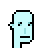


Step 1: Let's add the cap forward.

``` ruby
capforward = Image.parse( <<TXT, colors: ['000000','353535','515151'] )
. . @ @ @ @ @ @ @ . . . .
. @ x o o o o o o @ . . .
@ x o o o o o o o o @ . .
@ o o o @ @ @ @ @ @ @ @ .
@ o o @ x x x x x x x x @
@ @ @ @ @ @ @ @ @ @ @ @ @
TXT

capforward.save( 'capforward.png' )
capforward.zoom(4).save('capforwardx4.png')
```


and let's put on the cap:

``` ruby
mr.compose!( capforward, 6, 4 )
mr.zoom(4).save( 'mrmonalisax4_1.png' )
```

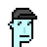


Step 2: Let's add the small shades.

``` ruby
smallshades = Image.parse( <<TXT, colors: ['000000'] )
@ @ @ @ @ @ @ @ @ @ @ @
. . . . @ @ . . . @ @ .
. . . . @ @ . . . @ @ .
TXT

smallshades.save( 'smallshades.png' )
smallshades.zoom(4).save( 'smallshadesx4.png' )
```


and let's put on the shades:

``` ruby
mr.compose!( smallshades, 5, 11 )
mr.zoom(4).save( 'mrmonalisax4_2.png' )
```


Step 3: Let's add the pipe.

``` ruby
pipe = Image.parse( <<TXT, colors: ['000000', '683c08', '855114', 'b9b9b980'] )
. . . . . . . ^ . .
. . . . . . ^ ^ ^ .
. . . . . . ^ ^ ^ .
. . . . . . . . . .
. . . . . . . ^ . .
. . . . . . . . . .
. . . . . . . ^ . .
. @ . . . . . . . .
@ o @ . . @ @ @ @ @
. @ o @ . @ o o o @
. . @ o @ @ x o x @
. . . @ o o o x @ .
. . . . @ @ @ @ . .
TXT

pipe.save( 'pipe.png' )
pipe.zoom(4).save( 'pipex4.png' )
```

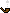
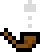


and let's smoke it:

``` ruby
mr.compose!( pipe, 13, 11 )
mr.save( 'mrmonalisa_3.png' )
mr.zoom(4).save( 'mrmonalisax4_3.png' )
```

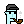


Bingo! A pixel perfect ~copy~ original!


Why stop? Let's add the missing magic smile!

Step 4: Let's add a smile.

Yes, a smile - is a single pixel at the x/y coordinates 9/17.


``` ruby
mr[9,17] = Color::BLACK
mr.save( './i/mrmonalisa.png' )
mr.zoom(4).save( './i/mrmonalisax4.png' )
```


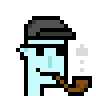


Now what? For fun let's redo all steps with
a female alien punk archetype.


``` ruby
mrs = Image.parse( <<TXT, colors: ['000000', '75bdbd', '9be0e0', 'c8fbfb'] )
. . . . . . . . . . . . . . . . . . . . . . . .
. . . . . . . . . . . . . . . . . . . . . . . .
. . . . . . . . . . . . . . . . . . . . . . . .
. . . . . . . . . . . . . . . . . . . . . . . .
. . . . . . . . . . . . . . . . . . . . . . . .
. . . . . . . . . . . . . . . . . . . . . . . .
. . . . . . . . . . . . . . . . . . . . . . . .
. . . . . . . . . @ @ @ @ @ @ . . . . . . . . .
. . . . . . . . @ ^ ^ ^ ^ ^ ^ @ . . . . . . . .
. . . . . . . @ ^ ^ ^ ^ ^ ^ ^ ^ @ . . . . . . .
. . . . . . . @ ^ ^ ^ ^ ^ ^ ^ ^ @ . . . . . . .
. . . . . . . @ ^ ^ ^ ^ ^ ^ ^ ^ @ . . . . . . .
. . . . . . @ ^ ^ x @ ^ ^ ^ x @ @ . . . . . . .
. . . . . . @ ^ ^ @ o ^ ^ ^ @ o @ . . . . . . .
. . . . . . @ @ ^ ^ ^ ^ ^ ^ ^ ^ @ . . . . . . .
. . . . . . . @ ^ ^ ^ ^ o ^ ^ ^ @ . . . . . . .
. . . . . . . @ ^ ^ ^ ^ o ^ ^ ^ @ . . . . . . .
. . . . . . . @ ^ ^ ^ ^ ^ ^ ^ ^ @ . . . . . . .
. . . . . . . @ ^ ^ ^ @ @ @ ^ ^ @ . . . . . . .
. . . . . . . . @ ^ ^ ^ ^ ^ ^ @ . . . . . . . .
. . . . . . . . @ ^ @ ^ ^ ^ @ . . . . . . . . .
. . . . . . . . @ ^ ^ @ @ @ . . . . . . . . . .
. . . . . . . . @ ^ ^ ^ @ . . . . . . . . . . .
. . . . . . . . @ ^ ^ ^ @ . . . . . . . . . . .
TXT

mrs.zoom(4).save( 'mrsmonalisax4_0.png' )
```

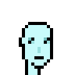


And let's add the cap forward,
the small shades, the pipe and the magic smile:

``` ruby
mrs.compose!( capforward, 7, 4 )
mrs.zoom(4).save( 'mrsmonalisax4_1.png' )

mrs.compose!( smallshades, 5, 11 )
mrs.zoom(4).save( 'mrsmonalisax4_2.png' )

mrs.compose!( pipe, 13, 11 )
mrs.zoom(4).save( 'mrsmonalisax4_3.png' )

mrs[10,17] = Color::BLACK
mrs.zoom(4).save( 'mrsmonalisax4.png' )
```


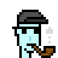


Let's put Mr & Mrs Mona Lisa together in a 2x1 composite.

``` ruby
mrmrs = Punks::Image::Composite.new( 2, 1 )
mrmrs << mr
mrmrs << mrs

mrmrs.save( 'mrmrsmonalisa.png' )
mrmrs.zoom(4).save( 'mrmrsmonalisax4.png' )
```

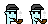


One more thing! Did you know?
The original Mona Lisa is looking left not right!
Let's mirror, that is, flip vertically
for a "Mr & Mrs Mona Lisa, The Left Edition":

``` ruby

mrmrs.mirror.save( 'mrmrsmonalisa_left.png' )
mrmrs.mirror.zoom(4).save( 'mrmrsmonalisa_leftx4.png' )
```

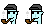
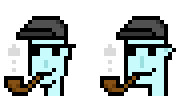


That's it.

Now it's your turn. Yes, you can!
Create the next super rare digital mona lisa.
