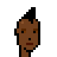
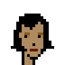

# 7 Quick & Easy Hairstyles with Simple Instructions to Do in a Few Minutes - Trendy Ideas for Punkettes to Try in 2021 - Is Orange the New Black?


Let's try out some hair dos and colors.
What's trendy in 2021?

Step 0: Let's start with a (bald no hair) female human punk archetype, that is, a "plain vanilla" zero-attributes design:


``` ruby
require 'cryptopunks'


punkette_design =<<TXT
. . . . . . . . . . . . . . . . . . . . . . . .
. . . . . . . . . . . . . . . . . . . . . . . .
. . . . . . . . . . . . . . . . . . . . . . . .
. . . . . . . . . . . . . . . . . . . . . . . .
. . . . . . . . . . . . . . . . . . . . . . . .
. . . . . . . . . . . . . . . . . . . . . . . .
. . . . . . . . . . . . . . . . . . . . . . . .
. . . . . . . . . @ @ @ @ @ @ . . . . . . . . .
. . . . . . . . @ ^ ^ ^ ^ ^ ^ @ . . . . . . . .
. . . . . . . @ ^ ~ ^ ^ ^ ^ ^ ^ @ . . . . . . .
. . . . . . . @ ^ ^ ^ ^ ^ ^ ^ ^ @ . . . . . . .
. . . . . . . @ ^ ^ ^ ^ ^ ^ ^ ^ @ . . . . . . .
. . . . . . @ ^ ^ x x ^ ^ ^ x x @ . . . . . . .
. . . . . . @ ^ ^ @ o ^ ^ ^ @ o @ . . . . . . .
. . . . . . @ @ ^ ^ ^ ^ ^ ^ ^ ^ @ . . . . . . .
. . . . . . . @ ^ ^ ^ ^ ^ ^ ^ ^ @ . . . . . . .
. . . . . . . @ ^ ^ ^ ^ @ ^ ^ ^ @ . . . . . . .
. . . . . . . @ ^ ^ ^ ^ ^ ^ ^ ^ @ . . . . . . .
. . . . . . . @ ^ ^ ^ % % % ^ ^ @ . . . . . . .
. . . . . . . . @ ^ ^ ^ ^ ^ ^ @ . . . . . . . .
. . . . . . . . @ ^ @ ^ ^ ^ @ . . . . . . . . .
. . . . . . . . @ ^ ^ @ @ @ . . . . . . . . . .
. . . . . . . . @ ^ ^ ^ @ . . . . . . . . . . .
. . . . . . . . @ ^ ^ ^ @ . . . . . . . . . . .
TXT

HUMAN_COLORS_LIGHT = ['000000','a66e2c','d29d60','dbb180','e7cba9','711010']

punkette = Image.parse( punkette_design, colors: HUMAN_COLORS_LIGHT )

punkette.save( 'punkette_light.png' )
punkette.zoom(4).save( 'punkette_lightx4.png' )
```


Salon hair time! Let's add a hair style.
Let's start with the side hair style in orange (that's the only
hair color in the original Lavra Lab series from 2017 with a side hair style do):


``` ruby
sidehair_design = <<TXT
. . . . . . . . . . . . . . . . . . . . . . . .
. . . . . . . . . . . . . . . . . . . . . . . .
. . . . . . . . . . . . . . . . . . . . . . . .
. . . . . . . . . . . . . . . . . . . . . . . .
. . . . . . . . . . . . . . . . . . . . . . . .
. . . . . . . . . . . . . . . . . . . . . . . .
. . . . . . . . . . @ @ @ @ . . . . . . . . . .
. . . . . . . . @ @ @ @ @ @ @ @ . . . . . . . .
. . . . . . . @ @ @ @ @ @ @ @ @ @ . . . . . . .
. . . . . . . @ @ @ @ @ @ @ @ @ @ . . . . . . .
. . . . . . . @ @ . . . . @ . @ @ @ . . . . . .
. . . . . . @ @ . . . . . . . . @ @ . . . . . .
. . . . . . @ @ . . . . . . . . @ @ . . . . . .
. . . . . . @ . . . . . . . . . @ @ . . . . . .
. . . . . . @ . . . . . . . . . @ @ . . . . . .
. . . . . . . . . . . . . . . . @ @ @ . . . . .
. . . . . . . . . . . . . . . . @ @ @ . . . . .
. . . . . . . . . . . . . . . . @ @ @ . . . . .
. . . . . . . . . . . . . . . . @ @ @ . . . . .
. . . . . . . . . . . . . . . . @ @ @ . . . . .
. . . . . . . . . . . . . . . @ @ @ @ . . . . .
. . . . . . . . . . . . . . @ @ @ @ @ . . . . .
. . . . . . . . . . . . . . @ @ @ . . . . . . .
. . . . . . . . . . . . . . . . . . . . . . . .
TXT

ORANGE = 'e65700'

sidehair = Image.parse( sidehair_design, colors: [ORANGE] )
sidehair.save( 'sidehair_orange.png' )
sidehair.zoom(4).save('sidehair_orangex4.png')
```


and all together:

``` ruby
punkette.compose!( sidehair )
punkette.save( 'punkette_light_side_orange.png' )
punkette.zoom(4).save( 'punkette_light_side_orangex4.png' )
```


Is Black the New Black? Let's try out more hair colors:

``` ruby
BLACK      = '000000'
BRUNETTE   = '51360c'
RED        = 'e22626'
YELLOW     = 'ffd926'
GREEN      = '28b143'
BLONDE     = 'fff68e'
WHITESMOKE = 'f5f5f5'


hair_colors = {
  'black'      => BLACK,
  'brunette'   => BRUNETTE,
  'red'        => RED,
  'orange'     => ORANGE,
  'green'      => GREEN,
  'blonde'     => BLONDE,
  'whitesmoke' => WHITESMOKE,
}


hair_colors.each do |hair_color_name, hair_color|
  punkette = Image.parse( punkette_design, colors: HUMAN_COLORS_LIGHT )
  hair     = Image.parse( sidehair_design, colors: [hair_color] )

  punkette.compose!( hair )

  name = "light_side_#{hair_color_name}"
  punkette.save( "punkette_#{name}.png" )
  punkette.zoom(4).save( "punkette_#{name}x4.png" )
end
```

Voila!


And let's try how the colors match with all skin tones (ligher, light, dark, darker):

``` ruby
skin_tones = {
  'lighter' => HUMAN_COLORS_LIGHTER,
  'light'   => HUMAN_COLORS_LIGHT,
  'dark'    => HUMAN_COLORS_DARK,
  'darker'  => HUMAN_COLORS_DARKER
}
```

and adjusting the hair stylist loop:

``` ruby
hair_colors.each do |hair_color_name, hair_color|
  hair = Image.parse( sidehair_design, colors: [hair_color] )

  skin_tones.each do |skin_tone_name, skin_tone_colors|
    punkette = Image.parse( punkette_design, colors: skin_tone_colors )

    punkette.compose!( hair )

    name = "#{skin_tone_name}_side_#{hair_color_name}"
    punkette.save( "punkette_#{name}.png" )
    punkette.zoom(4).save( "punkette_#{name}x4.png" )
  end
end
```

Voila!


4x


What's trendy in 2021?
Let's try out some more hair dos.

``` ruby
wildhair_design = <<TXT
. . . . . . . . . . . . . . . . . . . . . . . .
. . . . . . . . . . . . . . . . . . . . . . . .
. . . . . . . . . . . . . . . . . . . . . . . .
. . . . . . . . . . . . . . . . . . . . . . . .
. . . . . . . . . . . . . . . . . . . . . . . .
. . . . . . . . . . @ @ @ @ . @ . . . . . . . .
. . . . . . . @ . @ @ @ @ @ @ . . . . . . . . .
. . . . . . . @ @ @ @ @ @ @ @ @ . @ . . . . . .
. . . . . @ @ @ @ @ @ @ @ @ @ @ @ . @ . . . . .
. . . . . . @ @ @ @ . @ @ @ @ @ @ @ @ . . . . .
. . . . . @ @ @ @ . @ . @ . . @ @ @ . . . . . .
. . . . @ . @ @ @ . . . @ . . . @ @ @ . . . . .
. . . . . @ @ @ . . . . @ . . . . @ . @ . . . .
. . . . @ . @ . . . . . . @ . . . @ @ . . . . .
. . . @ @ @ @ . . . . . . . . . . @ @ . . . . .
. . . . . @ @ . . . . . . . . . . @ @ @ . . . .
. . . . . @ @ . . . . . . . . . . @ . . . . . .
. . . . @ . . . . . . . . . . . . . @ . . . . .
. . . . . . . . . . . . . . . . . . . . . . . .
TXT


wildhair = Image.parse( wildhair_design, colors: [BLACK] )
wildhair.save( 'wildhair_black.png' )
wildhair.zoom(4).save('wildhair_blackx4.png')
```


and let's adjust the hair stylist loop one more time:

``` ruby
hair_styles = {
  'side'     => sidehair_design,
  'wild'     => wildhair_design,
}

hair_styles.each do |hair_style_name, hair_style|
  hair_colors.each do |hair_color_name, hair_color|
    hair = Image.parse( hair_style, colors: [hair_color] )

    skin_tones.each do |skin_tone_name, skin_tone_colors|
      punkette = Image.parse( punkette_design, colors: skin_tone_colors )

      punkette.compose!( hair )

      name = "#{skin_tone_name}_#{hair_style_name}_#{hair_color_name}"
      punkette.save( "punkette_#{name}.png" )
      punkette.zoom(4).save( "punkette_#{name}x4.png" )
    end
  end
end
```

Voila!


4x


And

``` ruby
mohawk_design = <<TXT
. . . . . . . . . . . . . . . . . . . . . . . .
. . . . . . . . . . . . . . . . . . . . . . . .
. . . . . . . . . . . . . . . . . . . . . . . .
. . . . . . . . . . . . . @ @ . . . . . . . . .
. . . . . . . . . . . . @ @ @ . . . . . . . . .
. . . . . . . . . . . @ @ @ @ . . . . . . . . .
. . . . . . . . . . @ @ @ @ @ . . . . . . . . .
. . . . . . . . . @ @ @ @ @ @ . . . . . . . . .
. . . . . . . . . . . . @ @ . . . . . . . . . .
. . . . . . . . . . . . . @ . . . . . . . . . .
. . . . . . . . . . . . . . . . . . . . . . . .
TXT
```

Voila!


4x





And

``` ruby
bob_design = <<TXT
. . . . . . . . . . . . . . . . . . . . . . . .
. . . . . . . . . . . . . . . . . . . . . . . .
. . . . . . . . . . . . . . . . . . . . . . . .
. . . . . . . . . . . . . . . . . . . . . . . .
. . . . . . . . . . . . . . . . . . . . . . . .
. . . . . . . . . @ @ @ @ @ @ . . . . . . . . .
. . . . . . . @ @ @ @ @ @ @ @ @ . . . . . . . .
. . . . . . . @ @ @ @ @ @ @ @ @ @ . . . . . . .
. . . . . . @ @ @ @ @ @ @ @ . @ @ @ . . . . . .
. . . . . . @ @ . @ @ @ @ . . . @ @ . . . . . .
. . . . . . @ @ . . . @ . . . . @ @ . . . . . .
. . . . . @ @ @ . . . . . . . . @ @ . . . . . .
. . . . . @ @ . . . . . . . . . @ @ . . . . . .
. . . . . @ @ . . . . . . . . . @ @ . . . . . .
. . . . . @ @ @ . . . . . . . . @ @ . . . . . .
. . . . . @ @ @ . . . . . . . . @ @ @ . . . . .
. . . . . @ @ @ . . . . . . . . @ @ @ . . . . .
. . . . @ @ @ @ @ . . . . . . . @ @ @ @ . . . .
. . . . . . @ @ @ @ . . . . . @ @ . . . . . . .
. . . . . . . . . . . . . . . . . . . . . . . .
TXT
```

Voila!


4x





And

``` ruby
clown_design = <<TXT
. . . . . . . . . . . . . . . . . . . . . . . .
. . . . . . . . . . . . . . . . . . . . . . . .
. . . . . . . . . . . . . . . . . . . . . . . .
. . . . . . . . . . @ @ @ . . . . . . . . . . .
. . . . . . . @ @ @ @ @ @ @ @ @ . . . . . . . .
. . . . . . @ @ @ @ @ @ @ @ @ @ @ . . . . . . .
. . . . . @ @ @ @ @ @ @ @ @ @ @ @ @ . . . . . .
. . . . @ @ @ @ @ @ @ @ @ @ @ @ @ @ @ . . . . .
. . . . @ @ @ @ @ @ @ @ @ @ @ @ @ @ @ . . . . .
. . . @ @ @ @ @ @ @ . . . . @ @ @ @ @ @ . . . .
. . . @ @ @ @ @ . . . . . . . . @ @ @ @ . . . .
. . . @ @ @ @ . . . . . . . . . @ @ @ @ . . . .
. . . . @ @ . . . . . . . . . . @ @ @ . . . . .
. . . . @ @ . . . . . . . . . . . @ @ . . . . .
. . . . @ @ . . . . . . . . . . . . @ . . . . .
. . . . . @ @ . . . . . . . . . . @ . . . . . .
. . . . . . @ . . . . . . . . . . @ . . . . . .
. . . . . . . . . . . . . . . . . . . . . . . .
TXT
```


4x


And

``` ruby
straight_design = <<TXT
. . . . . . . . . . . . . . . . . . . . . . . .
. . . . . . . . . . . . . . . . . . . . . . . .
. . . . . . . . . . . . . . . . . . . . . . . .
. . . . . . . . . . . . . . . . . . . . . . . .
. . . . . . . . . . . . . . . . . . . . . . . .
. . . . . . . . . . . . . . . . . . . . . . . .
. . . . . . . . . . . . . . . . . . . . . . . .
. . . . . . . . . @ @ @ @ @ @ . . . . . . . . .
. . . . . . . . @ @ @ @ @ @ @ @ . . . . . . . .
. . . . . . . @ @ @ @ @ @ @ @ @ @ . . . . . . .
. . . . . . @ @ @ @ . . . . . @ @ . . . . . . .
. . . . . . @ @ @ . . . . . . . @ . . . . . . .
. . . . . . @ @ @ . . . . . . . @ . . . . . . .
. . . . . @ @ @ . . . . . . . . @ . . . . . . .
. . . . . @ @ @ . . . . . . . . @ . . . . . . .
. . . . . @ @ @ . . . . . . . . @ . . . . . . .
. . . . . @ @ @ . . . . . . . . @ . . . . . . .
. . . . . @ @ @ . . . . . . . . @ . . . . . . .
. . . . . @ @ @ . . . . . . . . @ . . . . . . .
. . . . . @ @ @ . . . . . . . . @ . . . . . . .
. . . . . @ @ @ . . . . . . . @ @ . . . . . . .
. . . . . @ @ @ . . . . . . @ @ @ . . . . . . .
. . . . . @ @ @ . . . . . @ @ @ . . . . . . . .
. . . . . . . . . . . . . . . . . . . . . . . .
TXT
```


4x


And

``` ruby
pigtails_design = <<TXT
. . . . . . . . . . . . . . . . . . . . . . . .
. . . . . . . . . . . . . . . . . . . . . . . .
. . . . . . . . . . . . . . . . . . . . . . . .
. . . . . . . . . . . . . . . . . . . . . . . .
. . . . . . . . . . . . . . . . . . . . . . . .
. . . . . . . . . @ @ @ @ @ @ . . . . . . . . .
. . . . @ @ . . @ @ @ @ @ @ @ @ . . @ @ . . . .
. . . @ @ @ @ x @ @ @ @ @ @ @ @ x @ @ @ @ . . .
. . @ @ @ @ @ @ @ @ @ @ @ @ @ @ @ @ @ @ @ @ . .
. . @ @ @ @ . @ @ @ . . . . . @ @ . @ @ @ @ . .
. . @ @ @ . . @ @ . . . . . . . @ . . @ @ @ . .
. . @ @ @ . . @ . . . . . . . . . . . @ @ @ . .
. . . @ . . . . . . . . . . . . . . . . @ . . .
. . . . . . . . . . . . . . . . . . . . . . . .
TXT
```


4x


That's it. Now it's your turn. Yes, you can!
Use your own hair style and color.
