# Appendix - Pixel Art Special Effects Gallery / Cheatsheet - Free Ideas & Recipes for Starting Your Own CryptoPunks Collection Today


Let's use the punks
alien  #3100,
zombie  #3393,
blondie  #172 and
beanie  #2964
to show off the special effects built into
the pixel art machinery.


## Zoom

Let's change the zoom factor.

4x:

``` ruby
punk.zoom(4)
```


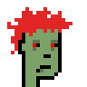
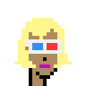


8x:

``` ruby
punk.zoom(8)
```

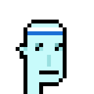

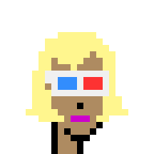
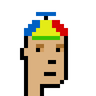


## Mirror - From Right-Facing to Left-Facing

Let's flip the pixels horizontally.


``` ruby
punk.mirror
```


  4x:

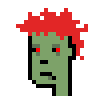
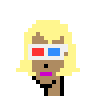


## 8-Bit Color Palette - Greyscale, Sepia, Blue, Futuristic False

Let's change the color to black & white or
more scientifically known as 8-bit grayscale, that is,
256 shades of gray
starting with black (`0x000000`)
and ending with white (`0xffffff`):


``` ruby
punk.grayscale
```


  4x:

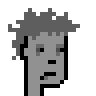


 §

Let's change the color palette to ye olde' sepia:

``` ruby
punk.change_palette8bit( Palette8bit::SEPIA )
```


  4x:


 §

Let's change the color palette to a blue theme:

``` ruby
punk.change_palette8bit( Palette8bit::BLUE )
```


  4x:


 §

Let's change the color palette to the futuristic false series:

``` ruby
punk.change_palette8bit( Palette8bit::FALSE )
```


  4x:


## Black & White (Pencil Drawing) Sketch

Let's change to a black & white (pecil drawing) sketch.

Sketch zoom - 4 pixels, line (brush) - 1 pixel   (the default):

``` ruby
punk.sketch( 4 )
```

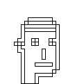
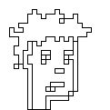


 §


Sketch zoom - 4 pixels, line (brush) - 4 pixels:

``` ruby
punk.sketch( 4, line: 4 )
```

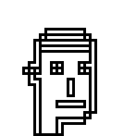
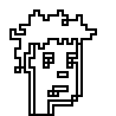
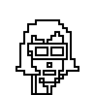


 §


Sketch zoom - 8 pixels, line (brush) - 2 pixels:

``` ruby
punk.sketch( 8, line: 2 )
```


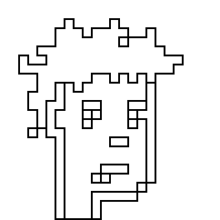


 §


Sketch zoom - 12 pixels, line (brush) - 3 pixels:

``` ruby
punk.sketch( 12, line: 3 )
```

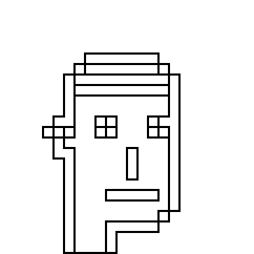

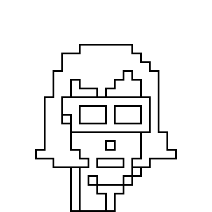
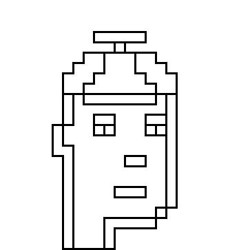


And some more.


